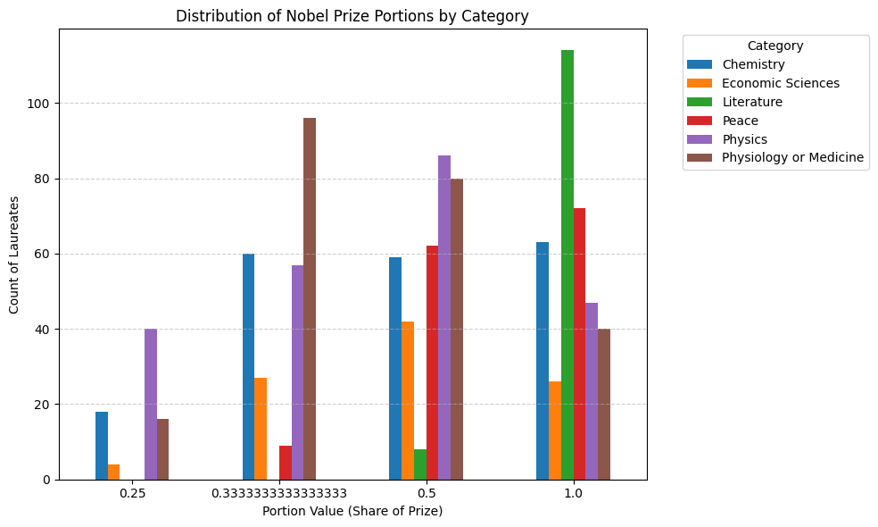

### Michael Stutzman

# Nobel Prize Data Acquisition using Python

## 1. Introduction

The Nobel Prize is one of the most prized awards in the world, it celebrates breakthroughs in various fields including Physics, Chemistry, Medicine, Literature, Peace, and Economic Sciences. The prize was first awarded in 1901 and has since recognized over 1000 individuals for their contributions to humanity. Each award can be given to up to three laureates in a given category. There is also a cash prize that accompanies the award, which has varied over time in actual value (adjusted for inflation). 

This project utilizes publically available data from the Nobel Prize organization through the public API. The processes used in this project are applicable to other datasets and APIs.

---

## 2: Motivating Questions

- How has the value of the prize changed over time?
- Which categories have shown the greatest changes in award patterns?
- Have portions for the prize changed over time? Over different categories?


---

## 3: Information on the Dataset

The dataset used is publically available through the Nobel Prize organization via their public API. The API provides access to data on laureates, prizes, and other related information. The data is returned in JSON format, which is a common format for web APIs. It is in good practice to not overwhelm public APIs with too many requests in a short period of time, so we will be using caching to store the data locally after the first request.

Requests can also be limited by only pulling data from certain years, or drawing a certain number of overall results. For this project, we will be pulling all available data. All code provided inlcudes citation of the API's official endpoint and documentation link. [Nobel Prize API Documentation](https://api.nobelprize.org/2.1/nobelPrizes)

---

## 4: Summary of Data Acquisition Process

The data was collected using python's 'requests' library and cleaned and sorted using 'pandas'. 

The following code snippet shows how to make a request to the Nobel Prize API and load the data into a pandas DataFrame for further analysis:

```python
# Base API URL
base_url = "https://api.nobelprize.org/2.1/nobelPrizes"

# Parameters for the API request
params = {
    "nobelPrizeYear": 1901, # starting year (starts 1901)
    "yearTo": 2025,        # up to current year (2025)
    "sort": "asc",
    "format": "json",
    "limit": 1026 # can adjust as needed (Max as of 2025 is 1026)
}

# Make the request
response = requests.get(base_url, params=params)
data = response.json()

# Extra steps here sorting the data and putting it in a desirable format.

# Save the data to a pandas DataFrame and CSV
df = pd.DataFrame(records)
df.to_csv("nobel_prizes_original.csv", index=False)
```
The steps in the process are accessing the API, looping through the JSON records and extracting relevant details, storing the data in a pandas DataFrame, and finally saving the cleaned data to a CSV file for future use. There are additional steps between storing the data and saving it to a CSV. These include sorting the data and putting it in a desirable format.

Additionally, I made dummy variables for the categories and portions. This was done to allow for multiple linear regression if desired. All of the original variables were kept in the final dataset as well. This made the dataset more versatile, allowing for string analysis on the 'motivation' variable.

---

## 5: EDA Highlights

Using matplotlib and seaborn, we can visualize some of the trends in the data to help us understand how the Nobel Prize has evolved over time. The following graphs highlight some of the interesting trends found in the data centered around the motivating questions.



The portion variable in our data indicates how many people were on the team that won, we can use 1/n to know how many people are in each group. Because a single award can be given to up to three people or an organization. The entries with 1/4 proportion are organizations that won the prize. 

From the plot we know that nearly all of literature prizes are given to single individuals, while the sciences and peace prizes are more likely to be shared among multiple laureates or organizations. Physics have the highest proportion of prizes given to organizations, while Medicine and Physiology have the highest rate of 3-person groups for the prize. It can be fairly intuitive why literature prizes are almost exclusively given to individuals, while other categories may favor group work. It is surprising to me that chemistry highly favors small-groups and individuals rather than organizations.


This plot shows the rolling average of the number of laureates per prize over time. We can see that in general, the number of laureates per prize has increased over time, indicating a trend towards more collaborative work being recognized. The Peace prize shows the most significant increase in the number of laureates per prize, which may reflect the complex nature of peace efforts that often involve multiple stakeholders. The other categories show a more modest increase, but the overall trend is clear: more people are being recognized for their contributions to these fields.


This plot shows the number of years without a prize being awarded in each category. The category for economic sciences only started in 1969, 68 years after all of the other categories had their first prizes awarded. So in reality, peace has the highest number of years without a prize awarded. 

## 6: Further Info

### The following links provide additional information on the dataset and tools used in this project:

- [Nobel Prize API Documentation](https://api.nobelprize.org/2.1/nobelPrizes)  
- [Nobel Prize Dataset (Official Portal)](https://www.nobelprize.org/)  
- [Pandas Documentation](https://pandas.pydata.org/docs/)  
- [Matplotlib Documentation](https://matplotlib.org/stable/index.html)  
- [Seaborn Documentation](https://seaborn.pydata.org/)  
- [Creative Commons CC0 License Info](https://creativecommons.org/publicdomain/zero/1.0/) 

## 7: Link to Github Repository

[GitHub Repository: acquisition_blog](https://github.com/stutzmanmichael/acquisition_blog)

## Sources
- [Nobel Prize Official Site](https://www.nobelprize.org/)