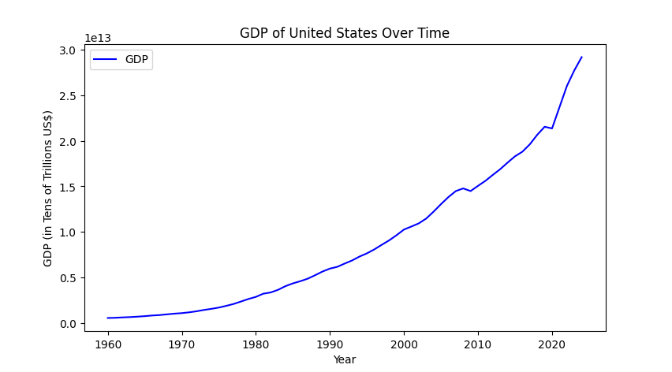
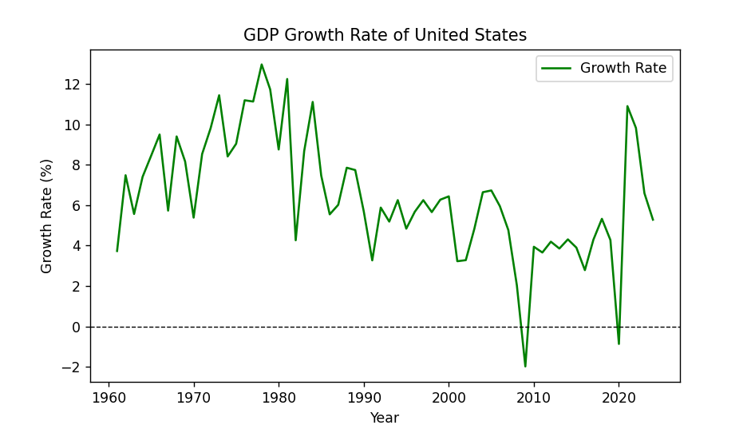

### Michael Stutzman

# Visualizing GDP Growth Over Time with Python

## Introduction
Gross Domestic Product (GDP) is one of the most important indicators in macroeconomics. Economists, analysts, politicians, and businesses all rely on GDP trends to understand the health of an economy. But raw GDP values aren’t always easy to interpret, visualization helps reveal trends and patterns that are hard to observe by just looking at the data.

Learning how to import, clean, and plot data in Python using `pandas` and `matplotlib` can help you in many areas of study, but today we will be focusing on GDP data. By the end, you’ll be able to create your own clear and professional plots for any dataset.

The tools and techniques shown here can be applied to other datasets as well, so feel free to adapt the code for your own projects. `pandas` and `matplotlib` are versatile libraries that can handle a wide range of data wrangling and visualization tasks.

---

## Step 1: Importing and Loading the Data
We’ll use Python’s standard data tools: `pandas` for wrangling and `matplotlib` for visualization. For this example we will use a CSV file called `gdp_data.csv` from the World Bank or IMF. This file contains GDP data for multiple countries over several decades. You may have to use different functions to load data from other formats like Excel or JSON.

```python
import pandas as pd
import matplotlib.pyplot as plt

# Load dataset
df = pd.read_csv("gdp_data.csv")

# Preview of the data
print(df.head())
```

---

## Step 2: Select Relevant Columns
Large macroeconomic datasets often contain many indicators. For this example we just need:

- **Year** (time variable)  
- **GDP (constant USD)**  

In this model, only one country will be analyzed at a time. For this example, we’ll use the United States. Feel free to change the country to any other available in the dataset if you follow along with the code yourself.

```python
# Pick a country
country = "United States"

# Filter for that country
gdp_row = df[df["Country Name"] == country]
```

---

## Step 3: Wrangle the Data
Make sure your data is numeric and sorted by year. In this dataset, years are columns, so we need to reshape the data. We want each observation to have its own row, not column, so we need to transform the data to be more easily read and plotted. We also need to make sure the years are saves as integers and not strings. We use the "coerce" method to handle any invalid data types and deal with any missing values or parsing errors that may arise. 

```python
# Reshape data: years as rows, GDP as values
gdp = gdp_row.loc[:, "1960":"2024"].T.reset_index()
gdp.columns = ["Year", "GDP"]

# Convert Year to int and GDP to numeric
gdp["Year"] = gdp["Year"].astype(int)
gdp["GDP"] = pd.to_numeric(gdp["GDP"], errors="coerce")
```

At this stage, we’re ready to calculate **GDP growth rates**:

<script type="text/javascript" async
  src="https://cdn.jsdelivr.net/npm/mathjax@3/es5/tex-mml-chtml.js">
</script>

\[
\text{Growth Rate} = \frac{\text{GDP}_{t} - \text{GDP}_{t-1}}{\text{GDP}_{t-1}} \times 100
\]

The growth given is the percentage change from one year to the next. We can use the `pct_change()` function in pandas to calculate this easily.

```python
gdp["GrowthRate"] = gdp["GDP"].pct_change() * 100
```

---

## Step 4: Visualize Trends
We’ll create two plots:  
1. Raw GDP over time  
2. GDP growth rate (percentage)  

There are a few things to keep in mind when plotting, such as labeling axes, adding titles, and using legends. Adjust the scale and add colors to make the plots more readable. In a scatterplot, it could be worth excluding some of the outliers (ie: false data points) from the graph to preserve the automatic scaling of the axes.


```python
#GDP over time graph
plt.figure(figsize=(10, 5))
plt.plot(gdp["Year"], gdp["GDP"], color="blue", label="GDP")
plt.title(f"GDP of {country} Over Time")
plt.xlabel("Year")
plt.ylabel("GDP (in Tens of Trillions US$)")
plt.legend()
plt.show()

#Plot growth in percentage
plt.figure(figsize=(10, 5))
plt.plot(gdp["Year"], gdp["GrowthRate"], color="green", label="Growth Rate")
plt.axhline(0, color="black", linestyle="--", linewidth=0.8)
plt.title(f"GDP Growth Rate of {country}")
plt.xlabel("Year")
plt.ylabel("Growth Rate (%)")
plt.legend()
plt.show()
```

---





## Step 5: Interpret Results
The plots provide two complementary insights:

- **GDP trend**: Long-term trajectory of economic size. Can be compared across countries for examining total economic output.
- **Growth rate trend**: Year-to-year fluctuations, helpful for spotting recessions or booms. Can be compared across countries to see which economies are expanding faster.

From the graphs, we can see that the U.S. economy has generally grown consistently over time, with some periods of slower growth or contraction (notably around 2008 and 2020). The growth rate graph highlights these fluctuations more clearly. Fluctuations can point the analyst to investigate further into economic events during those periods. In 2008 there was a major financial crisis, and in 2020 the COVID-19 pandemic caused a significant economic downturn, these events are reflected in the GDP growth rates and overall GDP.

Here’s a simple comparison table:

| Year | GDP (USD) | Growth Rate (%) |
|------|-----------|-----------------|
| 2018 | 20,580,000,000,000 | 4.9 |
| 2019 | 21,430,000,000,000 | 3.3 |
| 2020 | 20,930,000,000,000 | -0.8 |
| 2021 | 22,990,000,000,000 | 10.4 |

*Table: Example U.S. GDP values (World Bank, constant USD)*

---

## Conclusion
Visualizing GDP makes abstract numbers and trends more tangible. Combining simple wrangling with clear plotting, you can track trends, identify shocks, and compare economies. The same data wrangling and visualization techniques can be applied to other projects and datasets according to the needs of your analysis. 

## Call to Action
Try running the code yourself with different countries in the dataset. Experiment with different styles of plots. Additionally, try to plot multiple countries on the same graph to compare their GDP growth trends side by side. This will help you understand how different economies perform relative to each other over time. You can also practice wrangling by combining countries to look at growth throughout different regions or continents. 

## Sources
- World Bank GDP Data: [https://data.worldbank.org/indicator/NY.GDP.MKTP.KD](https://data.worldbank.org/indicator/NY.GDP.MKTP.KD)

